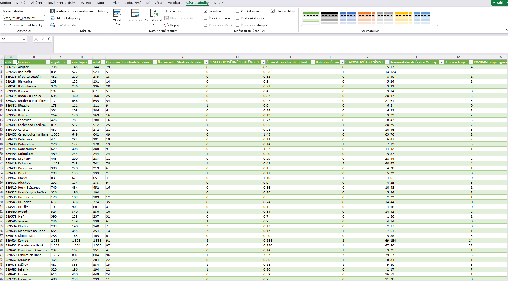

# Elections Scraper
Tento projekt je webový scraper výsledků voleb v České republice z roku 2017. Je zde však možnost scrapovat data o s jiných let zadáním jiné URL Adresy. Program získává data přímo z webu volby.cz a ukládá je do souboru CSV. Výsledky hlasování jsou stahovány pro všechny obce v rámci vybraného územního celku.


# Výstupní soubor
- Soubor obsahuje následující sloupce:

    * Kód obce
    * Název obce
    * Počet voličů v seznamu
    * Vydané obálky
    * Platné hlasy
    * Hlasy pro jednotlivé strany (každá strana má svůj vlastní sloupec)

# Ukázka CSV výstupu

>> python main.py "https://www.volby.cz/pls/ps2017nss/ps32?xjazyk=CZ&xkraj=12&xnumnuts=7103" "vote_results_prostejov"
--------------------------------------------------------------------
kod_obce,nazev_obce,volici,vydane_obalky,platne_hlasy,ODS,ANO,ČSSD...
506761,Alojzov,205,145,144,29,80,15...
589268,Bedihošť,834,527,524,51,230,40...
589276,Bílovice-Lutotín,431,279,275,13,120,50...
--------------------------------------------------------------------



## Použité technologie
- **Jazyk:** Python  
- **Knihovny:** 
    - uvedené v souboru requirements.txt

## Struktura projektu
- `main.py` - Obsahuje kompletní kód projektu 
- `zadani_projektu.txt` - Plné zadání projektu  
- `README.md` - Tento soubor
- `requirements.txt` - Seznam knihoven, které je nutné nainstalovat pro spuštění projektu.

## Instalace a spuštění
1. **Naklonujte repozitář:**
   git clone https://github.com/MatejLauterkranc/Engeto_project.git

2. Otevřete složku Python

3. Vyberte složku Project 3

4. Vytvoření virtuálního prostředí:
    ```bash
    python -m venv venv
    ```

5. Aktivace virtuálního prostředí:
    - Windows:
        ```bash
        venv\Scripts\activate
        ```
    - macOS / Linux:
        ```bash
        source venv/bin/activate
        ```

6. Instalace závislostí:

    ```bash
    pip install -r requirements.txt
    ```

7. Spuštění scriptu:
    - 6.1) Do terminálu zadejte následující příkaz, nahraďte "URL Adresa" a "Název výstupního souboru" skutečnými hodnotami:
    ```bash
    python main.py "URL Adresa" "Název výstupního souboru"
    ```

    - Přiklad spuštění:
    ```bash
    python main.py "https://www.volby.cz/pls/ps2017nss/ps32?xjazyk=CZ&xkraj=12&xnumnuts=7103" "vote_results_prostejov"
    ```
    - 6.2) Program se zeptá uživatele v jakém formátu si přeje výstupní soubor zda 1.CSV, 2.JSON nebo 3.Excel
    - Po výběru se začnou scrapovat data které se uloží s uživatelem zadaným názvem souboru
## Kontakt
Máte otázky? Kontaktujte mě na [LinkedIn](https://www.linkedin.com/in/mat%C4%9Bj-lauterkranc-8a9b7a228/) nebo přes e-mail: m.lauterkranc@gmail.com  
 
## Budoucí možné vylepšení
- Přidání grafického rozhraní pro výběr územního celku.
